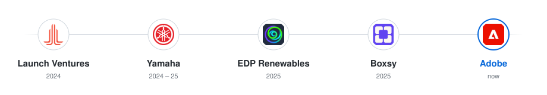

# Hey, I'm Aditya 👋

**Software Engineering Intern @ Adobe** · Purdue CS '27

[Website](https://theadityaagarwal.com) · [LinkedIn](https://www.linkedin.com/in/aditya130805/) · [Email](mailto:aditya130805@gmail.com)

 

  <picture>
    <source media="(max-width: 600px) and (prefers-color-scheme: dark)" srcset="./assets/path-narrow-dark.svg">
    <source media="(max-width: 600px)" srcset="./assets/path-narrow-light.svg">
    <source media="(prefers-color-scheme: dark)" srcset="./assets/path-dark.svg">
    
  </picture>

---

I like building things that feel good to use and hold up under the hood — applied AI, realtime systems, and the quiet infrastructure that makes products work.

### Things I've made

- **[Cardigarch](https://cardigarch.com)** — realtime multiplayer card game (still shipping)
- **[TravelMontage](https://travelmontage.com)** — trip photos → a swipeable story in about a minute
- **[WallPreview](http://wallpreviews.com/)** — preview wallpaper on a photo of your wall
- **BoilerMake XII** — 2nd overall with an AI mock-interview tool

### Stack

  &nbsp;
  &nbsp;
  &nbsp;
  &nbsp;
  &nbsp;
  &nbsp;
  &nbsp;
  &nbsp;
  

---

  
  

  Always down to chat about AI, games, or shipping stuff —
  <a href="mailto:aditya130805@gmail.com">say hi</a>

