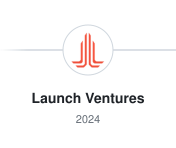
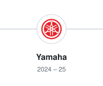
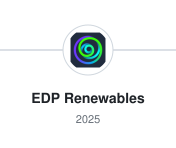
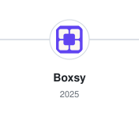
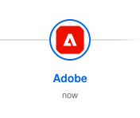

  <picture>
    <source media="(prefers-color-scheme: dark)" srcset="./assets/header-dark.svg">
    
  </picture>

<a href="https://theadityaagarwal.com"><picture><source media="(prefers-color-scheme: dark)" srcset="./assets/social-website-dark.svg"></picture></a> <a href="https://www.linkedin.com/in/aditya130805/"><picture><source media="(prefers-color-scheme: dark)" srcset="./assets/social-linkedin-dark.svg"></picture></a> <a href="mailto:aditya130805@gmail.com"><picture><source media="(prefers-color-scheme: dark)" srcset="./assets/social-email-dark.svg"></picture></a>

---

<h3 align="center">Where I've worked</h3>

<a href="https://www.linkedin.com/company/launch-ventures/"><picture><source media="(max-width: 700px) and (prefers-color-scheme: dark)" srcset="./assets/card-launch-dark.svg"><source media="(max-width: 700px)" srcset="./assets/card-launch-light.svg"><source media="(prefers-color-scheme: dark)" srcset="./assets/role-launch-dark.svg"></picture></a><a href="https://www.linkedin.com/company/yamaha-motor-corporation-usa/"><picture><source media="(max-width: 700px) and (prefers-color-scheme: dark)" srcset="./assets/card-yamaha-dark.svg"><source media="(max-width: 700px)" srcset="./assets/card-yamaha-light.svg"><source media="(prefers-color-scheme: dark)" srcset="./assets/role-yamaha-dark.svg"></picture></a><a href="https://www.linkedin.com/company/edprna/"><picture><source media="(max-width: 700px) and (prefers-color-scheme: dark)" srcset="./assets/card-edp-dark.svg"><source media="(max-width: 700px)" srcset="./assets/card-edp-light.svg"><source media="(prefers-color-scheme: dark)" srcset="./assets/role-edp-dark.svg"></picture></a><a href="https://www.linkedin.com/company/boxsy/"><picture><source media="(max-width: 700px) and (prefers-color-scheme: dark)" srcset="./assets/card-boxsy-dark.svg"><source media="(max-width: 700px)" srcset="./assets/card-boxsy-light.svg"><source media="(prefers-color-scheme: dark)" srcset="./assets/role-boxsy-dark.svg"></picture></a><a href="https://www.linkedin.com/company/adobe/"><picture><source media="(max-width: 700px) and (prefers-color-scheme: dark)" srcset="./assets/card-adobe-dark.svg"><source media="(max-width: 700px)" srcset="./assets/card-adobe-light.svg"><source media="(prefers-color-scheme: dark)" srcset="./assets/role-adobe-dark.svg"></picture></a>

---

I like building things that feel good to use and hold up under the hood — applied AI, realtime systems, and the quiet infrastructure that makes products work.

### Things I've made

- **[Cardigarch](https://cardigarch.com)** — realtime multiplayer card game (still shipping)
- **[TravelMontage](https://travelmontage.com)** — trip photos → a swipeable story in about a minute
- **[WallPreview](http://wallpreviews.com/)** — preview wallpaper on a photo of your wall
- **BoilerMake XII** — 2nd overall with an AI mock-interview tool

### Stack

  &nbsp;
  &nbsp;
  &nbsp;
  &nbsp;
  &nbsp;
  &nbsp;
  &nbsp;
  &nbsp;
  

---

  Always down to chat about AI, games, or shipping stuff —
  <a href="mailto:aditya130805@gmail.com">say hi</a>

