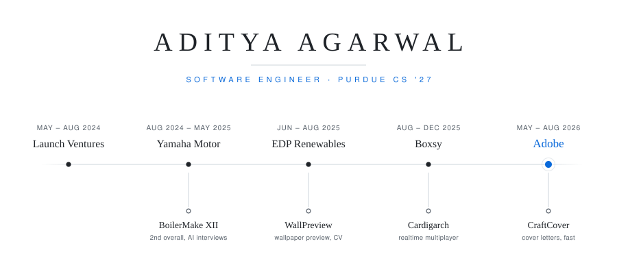

  <picture>
    <source media="(max-width: 600px) and (prefers-color-scheme: dark)" srcset="./assets/spine-narrow-dark.svg">
    <source media="(max-width: 600px)" srcset="./assets/spine-narrow-light.svg">
    <source media="(prefers-color-scheme: dark)" srcset="./assets/spine-dark.svg">
    
  </picture>

  <em>Above the line, where I've worked. Below it, what I was building at the time.</em>

  <a href="https://theadityaagarwal.com">Website</a>
  &nbsp;·&nbsp;
  <a href="https://www.linkedin.com/in/aditya130805/">LinkedIn</a>
  &nbsp;·&nbsp;
  <a href="mailto:aditya130805@gmail.com">Email</a>

---

CS at Purdue, class of 2027. I tend to gravitate toward the unglamorous half of a
product — the log pipeline behind the dashboard, the reconnect logic behind the
smooth game, the retrieval quality behind the agent. Most of my work lately has
been applied AI and the infrastructure that makes it usable by people who didn't
build it.

## Experience

**Adobe** — Software Engineer Intern · San Jose, CA · May–Aug 2026  
Built an AI diagnostic engine that reads across Adobe Cloud Manager, Splunk,
Kubernetes and Azure logs to pinpoint root causes — in production with **75+
enterprise support engineers**. Unified those fragmented log sources into one
troubleshooting interface, and cut local workspace startup from **7 minutes to 7
seconds** with persistent Docker volumes and conditional S3 snapshot restores.

**Boxsy** — Data Science Researcher · Remote · Aug–Dec 2025  
Built data ingestion pipelines over founder email and calendar activity, with NLP
models that identify funding events and advance pipeline stages at **97%
accuracy** — surfaced to founders as a single real-time view of their raise.

**EDP Renewables North America** — Software Engineer Intern, Applied AI · Houston, TX · Jun–Aug 2025  
Shipped a natural-language agent over **16,800+ CRM landowner leads**, giving 50+
project developers faster answers going into meetings. Also delivered an
Appian-based workflow system for environmental proposal research, with
multi-level approvals.

**Yamaha Motor Corporation** — Data Science Researcher · West Lafayette, IN · Aug 2024–May 2025  
Automated and optimized factory production scheduling for Yamaha propellers —
**10% more throughput** and roughly **$100k a year** in operational savings — and
built the pipelines feeding order and production data into real-time analytics.

**Launch Ventures** — Software Engineer Intern, Applied AI · Remote · May–Aug 2024  
Built an AI agent that merged multi-platform data into user profiles, and RAG
pipelines that improved documentation accessibility by 25% at an **F1 of 89%**.
Led UI and web app development in Vue, with AWS deployment and Stripe billing.

Boxsy and Yamaha were research placements through Purdue's Data Mine.
Earlier: ML research at Purdue's Weldon School of Biomedical Engineering.

## Selected work

**[Cardigarch](https://cardigarch.com)** — realtime multiplayer property-trading
card game. Quick match, spicy mode, solo play against bots, leaderboards and
achievements. Still actively shipping to it.

**[CraftCover](https://craftcover.vercel.app)** — turns a resume and a job post
into a tailored cover letter in seconds.

**[WallPreview](http://wallpreviews.com/)** — upload a photo of your wall and
preview wallpaper on it, using image segmentation.

**BoilerMake XII** — 2nd overall, for an AI mock-interview tool.

## Stack

**Languages** Python · TypeScript · Java · Scala · C · Swift  
**Web** React · Next.js · Vue · Django · FastAPI  
**Data & infra** PostgreSQL · Redis · Docker · AWS · GCP · Azure

---

  Happy to talk about applied AI, agent tooling, or realtime systems —
  <a href="mailto:aditya130805@gmail.com">aditya130805@gmail.com</a>

